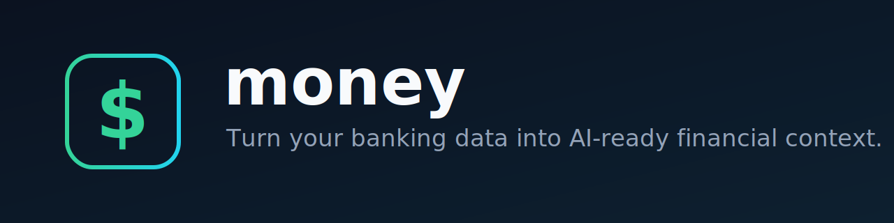
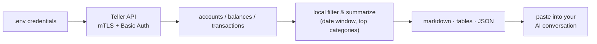

<p align="center">
  
</p>

# money

**Turn your Teller banking data into AI-ready financial context.**

`money` is a tiny local CLI that fetches your accounts, balances, and transactions from the [Teller API](https://teller.io) and turns them into a clean markdown summary your AI agent can actually reason about. No server. No database. Nothing leaves your machine except a direct, authenticated call to your bank's API.

<p>
  <a href="https://github.com/codyhxyz/money/actions/workflows/ci.yml"></a>
  <a href="https://github.com/codyhxyz/money"></a>
  
  <a href="./LICENSE"></a>
</p>

> **What it gives you.** Run one command, get a single block of markdown — balances, cash-flow summary, top categories and merchants, recent transactions — that you paste into any LLM conversation to get real, grounded financial advice instead of guesses.

## What it does & why

`money` exists to close a gap: your AI assistant is great at financial reasoning but has no access to your actual money. Wiring an agent to your bank account directly is risky and overkill for most people. `money` takes the simple path — **fetch → summarize locally → paste** — so your data arrives in your conversation as plain text, on your terms.

**Design principles:**

- **Local-first.** Runs on your machine; no server, no persistence, no telemetry.
- **Minimal.** One job: shape Teller data into AI-ready context. No framework, no SDK bloat.
- **Deterministic output** that's easy to read and easy to diff.
- **Fail closed.** Missing credentials stop the run; nothing is ever guessed.
- **Privacy by default.** Credentials are gitignored and never printed; account IDs can be redacted before you share output.

## Quickstart — for humans working with AI

You don't type these commands. You tell your AI assistant what you want and let it operate the tool for you. Point your agent at this README; it has everything it needs to set things up and run the tool.

**Say something like:**

> "Set up the `money` tool from `github.com/codyhxyz/money` and give me my financial context for the last 90 days."

**What only you can provide** (your agent can't do these — they're your banking credentials):

1. A **Teller application certificate + private key** — create/download these in the [Teller Dashboard](https://teller.io).
2. An **access token** — link a bank with Teller Connect. Your agent can serve the helper at [`examples/login.html`](./examples/login.html), you connect your bank in the browser, and the token appears for you to copy into `.env`.

**Your agent then runs the whole flow:**

```bash
pnpm install
cp .env.example .env
# agent fills .env with your credentials (never committed)
pnpm teller context --days 90      # prints markdown context
pnpm teller context --days 90 --redact-accounts   # safe to paste anywhere
```

Your agent returns the markdown to you (or pastes it straight into the conversation you're already in). That's the entire loop.

<details>
<summary><strong>Example: what the AI-ready context looks like</strong></summary>

Illustrative, redacted sample of <code>money context --days 90 --redact-accounts</code>:

```markdown
# Financial context from Teller

Generated: 2026-06-23T10:04:11.000Z
Window: last 90 days

## Account balances
| Account | Institution | Type | Last 4 | Available | Ledger | Currency |
| --- | --- | --- | --- | --- | --- | --- |
| Checking | Example Bank | checking | 4242 | $12,480.50 | $12,500.00 | USD |
| Savings | Example Bank | savings | 8810 | $48,210.00 | $48,210.00 | USD |

## Transaction summary
- Income: $8,200.00
- Spending: $5,317.42
- Net cash flow: $2,882.58
- Transactions included: 187

## Top spending categories
| Name | Total |
| --- | --- |
| groceries | $1,204.30 |
| restaurants | $612.18 |
| transport | $403.55 |
| subscriptions | $198.99 |

## Top counterparties / merchants
| Name | Total |
| --- | --- |
| Whole Foods | $486.12 |
| Uber | $311.40 |
| Spotify | $98.97 |

## Recent transactions
| Date | Account | Description | Category | Counterparty | Amount | Status |
| --- | --- | --- | --- | --- | --- | --- |
| 2026-06-22 | Checking | WHOLE FOODS MARKET | groceries | Whole Foods | -$72.18 | posted |
| 2026-06-21 | Checking | UBER TRIP | transport | Uber | -$23.40 | posted |
| 2026-06-15 | Checking | PAYROLL DEPOSIT | income | Acme Corp | $4,100.00 | posted |

Use this as concrete context for financial coaching. Do not infer facts that are not present in the data.
```

</details>

## Commands

`context` is the default command — that's all most people need. The rest are for inspecting raw data.

| Command | What it prints |
| --- | --- |
| `money context` *(default)* | AI-ready markdown summary of balances + recent transactions |
| `money accounts` | Accounts and balances as a table |
| `money transactions` | Recent transactions as a table |

**Flags:**

| Flag | Applies to | Default | Purpose |
| --- | --- | --- | --- |
| `--days <n>` | `context`, `transactions` | `90` | How many days of history to include |
| `--limit <n>` | `context`, `transactions` | `200` | Max transactions to fetch/print |
| `--account <id>` *(repeatable)* | `context`, `transactions` | all | Limit to specific account IDs |
| `--json` | all | off | Print raw JSON instead of human/agent format |
| `--redact-accounts` | `context` | off | Replace Teller account/enrollment IDs with `account_1`, `account_2`, … |
| `--env <path>` | global | `.env` | Path to your env file |

```bash
pnpm teller context --days 90 --limit 200
pnpm teller transactions --days 30 --json
pnpm teller context --account acc_xxx --account acc_yyy
pnpm teller context --redact-accounts        # before pasting anywhere
```

> **Note:** `pnpm teller` runs via `tsx`. Once published/linked, the binary is just `money`.

## Output formats

`money` speaks three formats so it slots into whichever workflow you use:

- **Markdown** (`context`) — paste into any LLM chat or agent. Grounded, structured, concise.
- **Tables** (`accounts`, `transactions`) — read it yourself in the terminal.
- **JSON** (`--json`) — feed to another local tool, script, or agent that wants the raw shape.

## How it works



| Entity | Source | Role in `money` |
| --- | --- | --- |
| User | you | Holds credentials and decides what data to share |
| Enrollment | Teller Connect access token | Grants API access — never printed |
| Account | `GET /accounts` | Maps your institution accounts |
| Balance | `GET /accounts/:id/balances` | Current cash/debt position |
| Transaction | `GET /accounts/:id/transactions` | Income/spend history |
| AI context | local output | Portable summary for an agent conversation |

**Repository layout:**

```text
src/
├── cli.ts          # commands & flags (commander)
├── config.ts       # .env + certificate loading
├── teller.ts        # Teller API client (mTLS + Basic Auth)
├── presenter.ts     # markdown/tables/summaries + redaction
├── types.ts         # minimal Teller-shaped types
└── index.ts         # library exports
examples/login.html  # Teller Connect token helper
.env.example         # safe config template
```

## Configuration

Copy the template and fill in your credentials:

```bash
cp .env.example .env
```

| Variable | Required | Purpose |
| --- | --- | --- |
| `TELLER_ACCESS_TOKEN` | yes | Access token from Teller Connect |
| `TELLER_CERT_PATH` / `TELLER_KEY_PATH` | yes* | Paths to your certificate/private-key PEM files |
| `TELLER_CERT` / `TELLER_KEY` | yes* | Or inline PEM contents (use `\n` escapes) |
| `TELLER_APPLICATION_ID` | optional | Used by `examples/login.html` only |
| `TELLER_API_BASE_URL` | optional | Defaults to `https://api.teller.io` |

\* Provide credentials **either** as file paths **or** as inline PEM — one of the two is required.

Keep certs and keys out of git (e.g. in an ignored `./certs/` directory). `.gitignore` already excludes `.env`, `certs/`, and PEM/key/crt files.

## Security & privacy

Because this touches your real money, the defaults are conservative:

- `.env`, `certs/`, and `*.pem` / `*.key` / `*.crt` files are gitignored.
- Access tokens, certificates, and private keys are **never** printed.
- Axios errors are sanitized so request config and auth headers aren't dumped.
- **Fail closed** on missing credentials — the run stops rather than guessing.
- Data goes only to Teller's API and back to your terminal. No third parties, no logging, no telemetry.
- Use `--redact-accounts` before pasting output anywhere you don't want your Teller account/enrollment IDs exposed.

You remain the trust boundary: credentials live on your machine, and you decide what output gets shared and where.

## Development

For contributors (separate from the user flow above):

```bash
pnpm install
pnpm typecheck     # tsc --noEmit
pnpm build         # compile to dist/
pnpm dev <cmd>     # run via tsx without building, e.g. pnpm dev context
```

The CLI program is wired in [`src/cli.ts`](./src/cli.ts); the Teller client in [`src/teller.ts`](./src/teller.ts); all output shaping in [`src/presenter.ts`](./src/presenter.ts).

## Roadmap & limitations

`money` is deliberately small. Current scope and known limits:

- Teller is the only data source.
- Summaries are aggregates over a date window — no categorization learning, no budgets, no forecasts.
- No server, no persistence, no scheduling; runs are one-shot.
- Distributed from GitHub only — install from source (a deliberate choice, not a TODO).

## Contributing

Issues and pull requests are welcome at [`codyhxyz/money`](https://github.com/codyhxyz/money). For bugs, include the command you ran and the sanitized error output (never your credentials). Keep changes minimal and aligned with the design principles above.

## Acknowledgements

Built on well-maintained, boring tools: the [Teller API](https://teller.io), [`axios`](https://github.com/axios/axios), [`commander`](https://github.com/tj/commander.js), and [`dotenv`](https://github.com/motdotla/dotenv).

## License

[MIT](./LICENSE) © 2026
